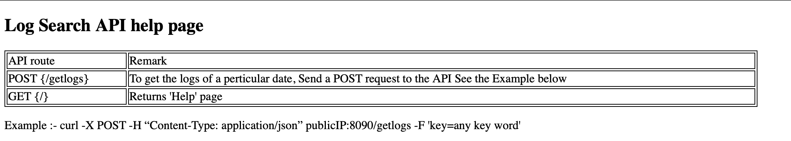

# Log search api server

This script is capable to run as REST api server. This is designed to run inside a docker container. 

You can search a specific entry in a log file with curl POST request as below.
```
 curl -X POST -H “Content-Type: application/json” IP_OF_HOSTED_SERVER/getlogs -F 'key=ANY_STRING_NEED_TO_SEARCH_ON_LOG'
```
I've already published public docker image on docker hub as below.
```
sesirir/log-search-api:latest
```
### You can build your own docker image and run it locally as below.

* If you are running locally, First you need to point below log path in a ``` app/main.py``` script to a ```Sample.log``` file.

```
    infile = r"./Sample.log"
```
* Then build docker image with below command
```
    docker build -t logSearchApi:latest .
```
* Then run docker container with below command.
```
    docker run -d -p 80:80 log-search-api:latest
```
* Now you can search a log entry in Sample.log file with below command.
```
curl -X POST -H “Content-Type: application/json” localhost/getlogs -F 'key=20220901_053307'
```

Also you can access a help page for the API server as below which shows all the api routes.

```
http://PUBLIC_IP:8090
```
